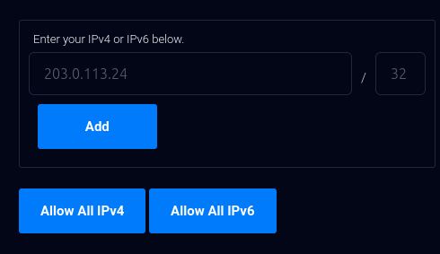

# Veilid Nodes on Vultr

Details at https://veilid.com/

As one of the less-known clouds, Vultr has some cheap instances in lots of different places worldwide. It's an easy way to run nodes that are outside of the usual zones (US/Europe), so this repo was set up to help you run some veilid nodes on Vultr!

## Cost

Vultr doesn't charge extra for IPv4 addresses, so we run these nodes dual-stack by default. The current configuration is about $5/month per node.

## Setup

You'll need terraform to run this, and you can get the installation instructions [here](https://developer.hashicorp.com/terraform/install).

You'll also need an account on Vultr, so create an account [here](https://www.vultr.com/) if you don't have one yet.

### Setup Walkthrough

1. Get an API key from Vultr. You can go to the [account settings](https://my.vultr.com/settings/#settingsapi) so create one. Vultr has a unique additional configuration in the UI where you can lock down the API key by IP address, which is preferable to keeping it open to be used from everywhere.

So get your IP address via `curl ipconfig.com` (or go to https://www.whatismyip.com/). Put the address in the form, and just use `32` as the second number after the `/` (that means this IP address and ONLY this IP address).



2. Copy `.env.example` to `.env` and add the API key value there. Then run `source .env` to get the API key value into your shell environment.

3. Fill in the value for your SSH key (if you want to be able to SSH in and poke around. If you don't, then just skip this part) in `setup-veilid.yaml`.

> If you want to use a separate SSH key, then generate one in this folder like `ssh-keygen -t ed25519 -o -a 100 -f veilid-key`. Then, make sure to update `setup-veilid.yaml` with the key contents.

4. Now you're ready to run `terraform init && terraform apply`.

You should see the IP addresses in the output at the end of running the command.

```sh
Outputs:

public_ipv4 = [
  "139.84.236.193",
  "64.176.14.35",
]
public_ipv6 = [
  "2a05:f480:3000:2e8f:5400:04ff:fedd:7510",
  "2001:19f0:c800:2cf0:5400:04ff:fedd:7513",
]
```

5. If you added an SSH key to use, you can now access the node(s) and see how veilid is running via

```sh
ssh -i PATH_TO_SSH_KEY veilid@IP_ADDRESS_FROM_OUTPUT
```
